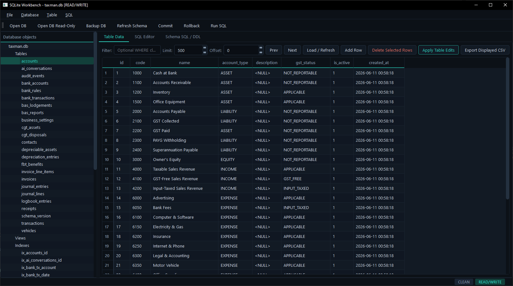
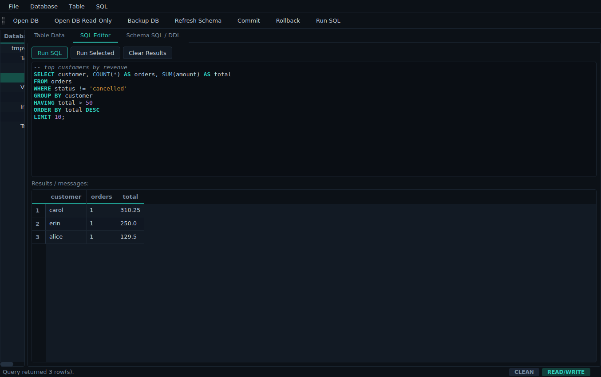

# SQLite Workbench


A dark-themed PyQt6 GUI for browsing and editing SQLite `.db`, `.sqlite`, and `.sqlite3` files, plus opening, editing, and running `.sql` scripts.



## Features

- Open SQLite databases in read/write mode.
- Open SQLite databases in read-only mode.
- Browse tables, views, indexes, and triggers in a schema tree.
- View schema DDL, with SQL syntax highlighting.
- View table rows with limit/offset paging.
- Apply simple `WHERE` filters.
- Edit table cells inline.
- Add rows.
- Delete selected rows.
- Commit or rollback pending changes as an explicit transaction step.
- Run SQL queries and scripts, with syntax highlighting in the editor.
- Open and save `.sql` files.
- Export displayed rows to CSV.
- Backup a database using SQLite's backup API.
- Safe identifier quoting for table/column names.
- Dark industrial theme (obsidian / teal / amber) with Fusion base style.
- Status bar chips showing connection mode (READ/WRITE, READ-ONLY) and pending-transaction state.
- BLOB cells are displayed but not directly edited.
- NULL values are represented as `<NULL>`.



## Install

```bat
python -m venv .venv
.venv\Scripts\python.exe -m pip install -r requirements.txt
```

On Linux/macOS:

```bash
python3 -m venv .venv
.venv/bin/pip install -r requirements.txt
```

## Run

```bat
.venv\Scripts\python.exe main.py
```

or, on Windows:

```bat
run.bat
```

## Editing workflow

1. Open a database.
2. Select a table on the left.
3. Edit cells in the table.
4. Click **Apply Table Edits**.
5. Click **Commit** to persist, or **Rollback** to discard.

## Notes

This is aimed at SQLite databases. It does not connect to MySQL, PostgreSQL, MSSQL, or remote database servers.

For safest editing, tables should have a primary key. If no primary key exists, the app tries to use SQLite `rowid`. Views and tables without a usable key are displayed read-only.

## Project structure

```
sqlite-workbench/
├── main.py          # application logic, PyQt6 widgets, SQLite I/O
├── theme.py         # dark industrial QSS theme + SQL syntax highlighter
├── requirements.txt
├── run.bat
└── pip.bat
```

## Roadmap

- Proper model/view implementation using `QAbstractTableModel` for very large tables.
- Schema designer for creating tables visually.
- Index/trigger editor.
- ERD diagram view.
- Cell-level type editor.
- Diff/preview before commit.
- Project/session save files.

## License

Apache License 2.0. See [LICENSE](LICENSE) for details.

Copyright © 2026 Leon Priest ([7h3v01d](https://github.com/7h3v01d))
